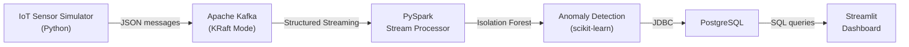

# Scalable IoT Sensor Data Pipeline

A real-time data pipeline that simulates smart city IoT sensors, processes streaming data with Apache Kafka and PySpark, detects anomalies using machine learning, and visualizes results in a live dashboard.

## Architecture



**Data flow:** 12 simulated sensors across 5 city zones generate readings for temperature, humidity, air quality, and traffic. Messages are published to Kafka, consumed by PySpark Structured Streaming, scored for anomalies using per-sensor-type Isolation Forest models, and persisted to PostgreSQL. A Streamlit dashboard polls the database and renders live charts with anomaly highlighting.

## Tech Stack

| Component | Technology | Version |
|-----------|-----------|---------|
| Data Generation | Python, confluent-kafka | 3.13, 2.6.1 |
| Message Broker | Apache Kafka (KRaft) | 3.9.0 |
| Stream Processing | PySpark Structured Streaming | 3.5.5 |
| Anomaly Detection | scikit-learn Isolation Forest | 1.6.1 |
| Storage | PostgreSQL | 16 |
| Dashboard | Streamlit, Plotly | 1.41, 6.0 |
| Containerization | Docker Compose | v2 |


## Project Structure

```
├── data_generator/          Simulates IoT sensors, publishes to Kafka
├── stream_processor/        PySpark Structured Streaming consumer
├── ml/                      Isolation Forest training and inference
├── database/                PostgreSQL schema (auto-initialized)
├── dashboard/               Streamlit real-time visualization
├── tests/                   Unit tests
└── docs/                    Architecture diagrams
```

## Design Decisions

**Kafka KRaft mode** — Eliminates Zookeeper dependency, reducing the Docker footprint to a single Kafka container. KRaft is the production-recommended mode since Kafka 3.3+.

**Per-sensor-type Isolation Forest** — Training separate models per sensor type avoids cross-type feature interference (temperature and AQI have fundamentally different distributions). Models use three features: raw value, hour of day, and rate of change.

**foreachBatch processing** — Allows converting each micro-batch to Pandas for scikit-learn inference. At this scale (~120 rows per batch), the overhead is negligible and keeps the ML integration straightforward.

**PostgreSQL over Delta Lake** — For a local development pipeline, PostgreSQL provides familiar SQL querying, easy Streamlit integration, and no dependency on cloud storage or HDFS.


